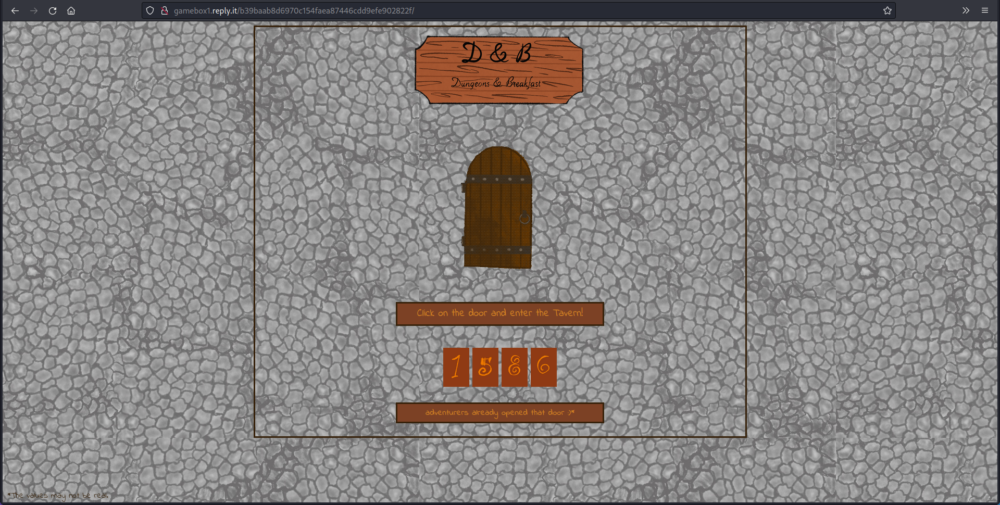
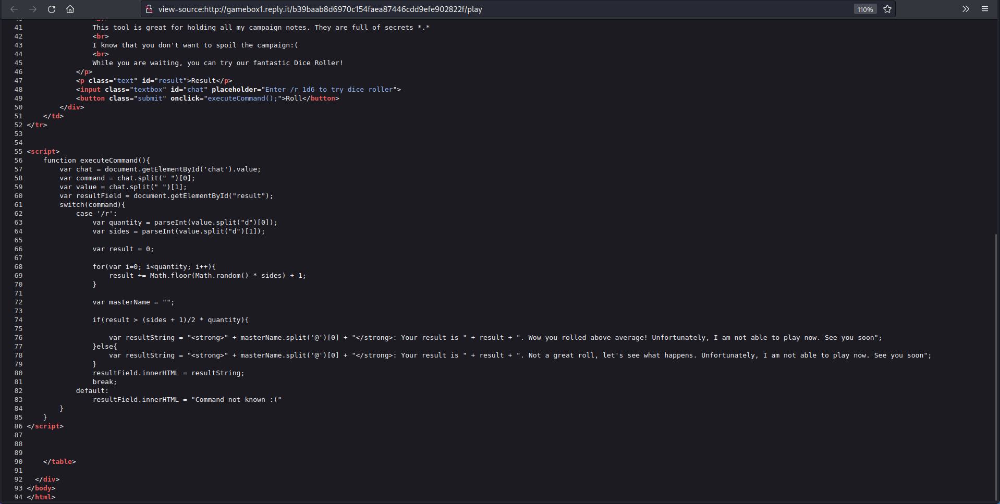
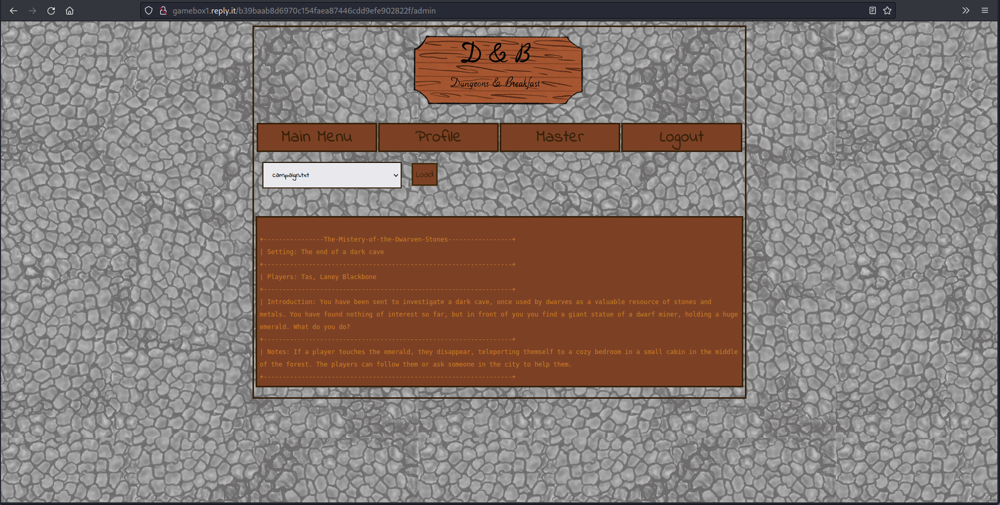
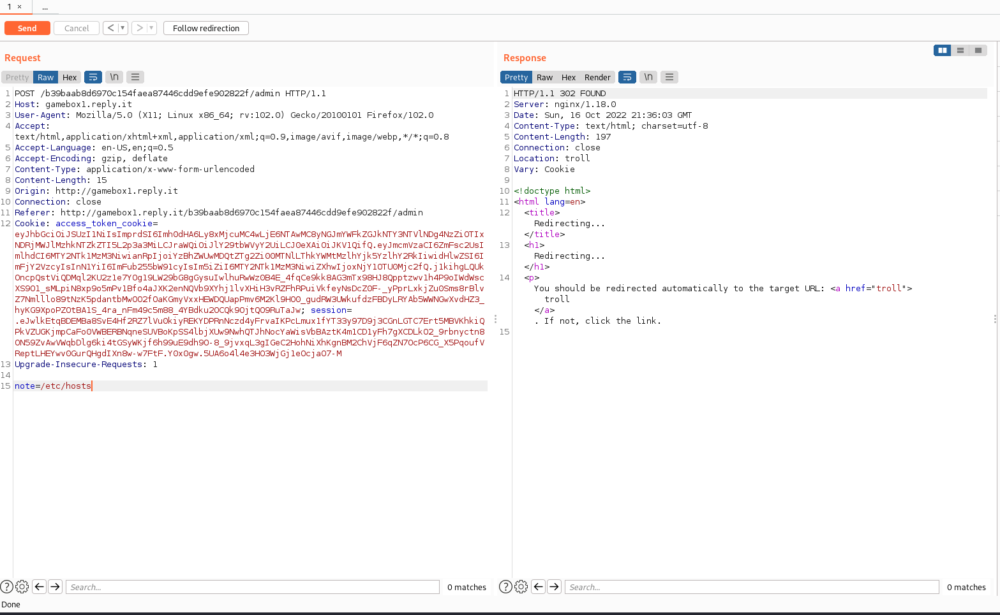
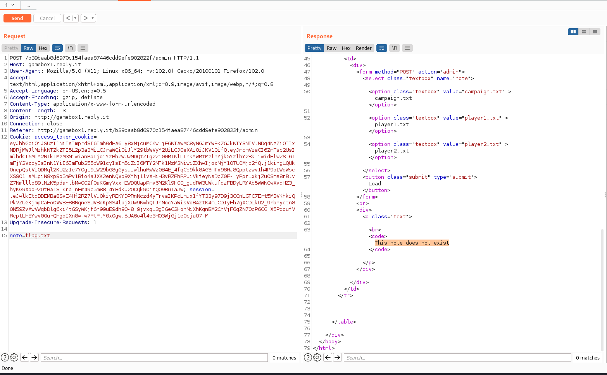

# Dungeons & Breakfast

> Description: Regeneration spans the universe and all possible universes: a point of contact between space and time that brings the subject back to life in a new body, leaving last damage in the souls of those who undergo it, with unforeseen influences that can also fracture time. R-Boy awakes and has the solution in his pocket, but he does not feel like embarking on such a selfish path. He decides to embrace his own “end of days”.
http://gamebox1.reply.it:80/b39baab8d6970c154faea87446cdd9efe902822f



Starting the challenge, the first thing we should do is register on the D&B portal with EMAIL and password. Once inside we would have a main menu where we can:
1) By clicking the dice, play a game.
2) By clicking on Profile, change our password (in web challenges, nothing is random, let's remember this for later).
3) By clicking on Master, it redirects us to a page where we don't have access at the moment.
4) Logout.


Proceeding with 1), We'll have a dice game, which we could try by submitting the command `/r 1d6` as suggested. If we try to look at the source code of the page we will be shown the source code of the game and an important info:
 


See it? We have the Master's email! What can we do now? Maybe try some SQL injection in the login form, but it doesn't work. There seems to be no way to find out or bypass the password. But wait, remember feature 2) ? We can try to change the master password...


It worked ! \
Logout, login as Master with the new password and access to feature 3), now we have access to the `/admin` page.



We can try to read the `.txt` files but they'll not give us hints to find the flag, only some players stats but this isn't interesting for us :P . \
However, just seeing the filenames in the possible choices stinks of LFI for an hacker. We can therefore intercept the request with BurpSuite, modify the value of the parameter `note` and try to read some internal files:





As we can see in the response there's a comment:

```html
<!-- TODO: review all the /secret notes and make them accessible. See: https://pastebin.com/TJMXHEB9 -->
```
Interesting, let's try to visit the [link](https://pastebin.com/TJMXHEB9):


Ok, we got leaked part of the source code. We can understand that it is a Flask webapp, that there seems to be some prevention from path trasversal by the `remove_dot_slash_recursive()` function, and finally that we can read any file inside the working directory. \
Maybe try to read `flag.txt`?



No luck. BUT the previous comment suggested us that there's some `/secret` directory... so what if we try to read `/secret/flag.txt` ?


Got it :)

> {FLG:Plz_d0nt_st34l_my_n0t3s}